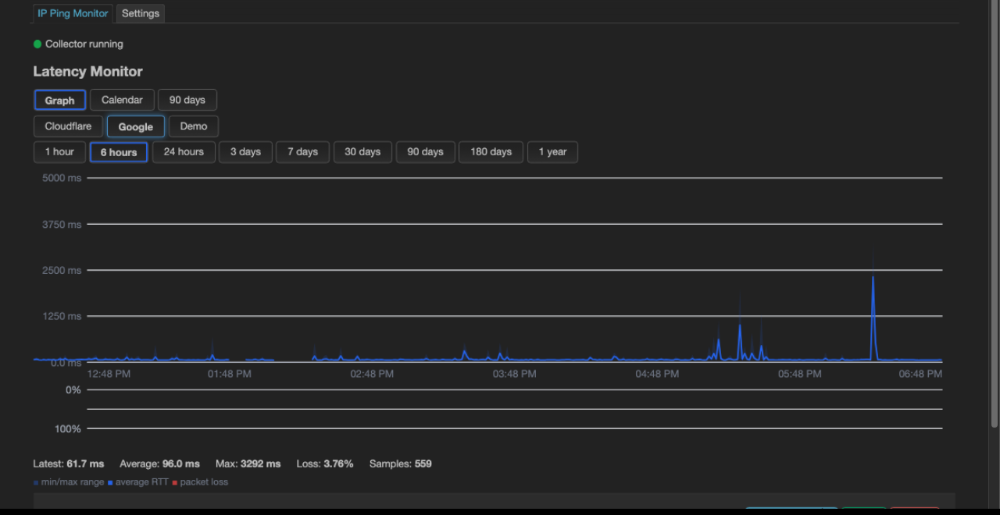
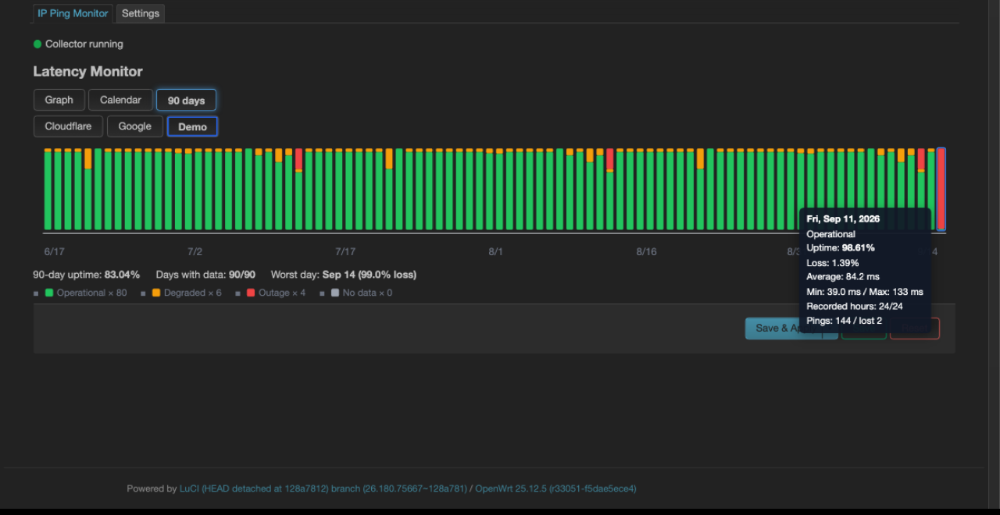
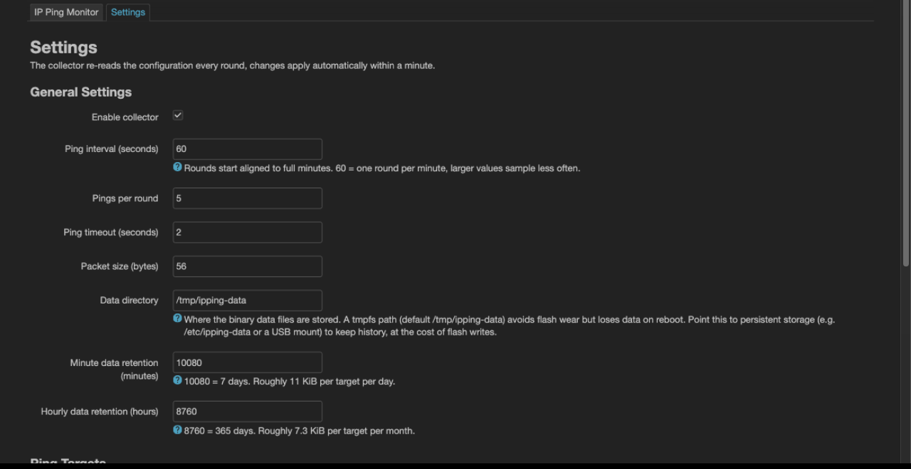

# luci-app-ipping — LuCI IP Ping Monitor

A lightweight OpenWrt LuCI application that periodically pings multiple targets, records
latency and packet loss in a compact **architecture-independent binary format**, and
visualizes everything directly in LuCI — as a latency graph, a month calendar and a
90-day status bar strip. Pure shell + client-side JS: **no compilation, `PKGARCH:=all`,
works on x86 / ARM / MIPS alike.**

| Graph | Calendar |
|---|---|
|  |  |

| 90-day status bars | Settings |
|---|---|
|  |  |

## Features

- **All-in-one LuCI integration** — Status → *IP Ping Monitor* provides the monitor
  page and a standard *Settings* page (collector options + target table).
- **Multiple targets, periodic pings** — each target gets its own dataset; every round
  sends N pings (default 5) and stores min/avg/max RTT plus sent/lost counters.
  IPv4 and IPv6 (automatic `ping -6` / `ping6` fallback), hostnames allowed.
- **Minute-level data**, default retention 7 days (configurable).
- **Hour-level data** averaged (sent-weighted) from the minute data, default retention
  365 days (configurable). Gaps after downtime are back-filled automatically.
- **Compact binary storage** — custom fixed-size records; no timestamps stored (time is
  implied by the file name and record offset). ≈ **166 KiB per target per year**.
- **Configurable storage location** — `/tmp/ipping-data` (tmpfs, no flash wear, default)
  or any persistent path.
- **Three views** — latency graph (min/max band + average line + loss bars with hover
  tooltip), month calendar with per-day grading, and a 90-day status-bar strip with
  per-day uptime details. 60 s auto-refresh.
- **Day grading** — an hour/day is *Degraded* at ≥ 2 % loss and *Outage* at ≥ 20 %
  (`LOSS_WARN` / `LOSS_BAD` in `monitor.js`).

## Installation

Grab a package from the [releases page](../../releases) — CI builds
`.ipk` (OpenWrt ≤ 23.05) and `.apk` (OpenWrt ≥ 24.10) for every release tag.

```sh
# OpenWrt ≤ 23.05 (opkg)
opkg install luci-app-ipping_1.0.0-1_all.ipk

# OpenWrt ≥ 24.10 (apk); unsigned CI builds need --allow-untrusted
apk add --allow-untrusted ./luci-app-ipping-1.0.0-1.apk
```

Then open **Status → IP Ping Monitor**. The post-install hook creates
`/etc/config/ipping` with two example targets and enables the collector at boot.

> After upgrading the package, hard-refresh the browser once (Ctrl+F5) — LuCI
> caches view modules aggressively.

## Building from source

Place this directory in an OpenWrt buildroot or SDK (`package/` or
`feeds/luci/applications/`, LuCI feed installed) and run:

```sh
make defconfig
make package/luci-app-ipping/compile V=s
```

The buildroot picks the packaging format automatically: `.ipk` on 23.05 and older,
`.apk` on 24.10 and newer. `tools/build-ipk.sh` can also produce an `.ipk` without an
SDK; `tools/build-apk.sh` needs the host `apk` binary from the OpenWrt apk fork
(`mkpkg`).

GitHub Actions (`.github/workflows/build.yml`) builds all three variants on every
`v*` tag and attaches them to the release automatically.

## Configuration (`/etc/config/ipping`)

| Option | Default | Description |
|---|---|---|
| `global.enabled` | `1` | master switch for the collector |
| `global.interval` | `60` | seconds between ping rounds, minute-aligned |
| `global.count` | `5` | pings per round (1–20) |
| `global.timeout` | `2` | per-ping timeout (s) |
| `global.size` | `56` | payload size (bytes) |
| `global.dbdir` | `/tmp/ipping-data` | storage directory |
| `global.minute_retention` | `10080` | minutes of minute-data (10080 = 7 d) |
| `global.hour_retention` | `8760` | hours of hourly-data (8760 = 365 d) |
| `target` (any number) | — | `name`, `host`, `enabled` |

Data files are keyed by the target *name* (or host); renaming a target starts a new
dataset. The daemon re-reads UCI every round — changes made in LuCI apply within a
minute, no restart needed.

## Binary data format

All integers little-endian. Timestamps are *not* stored: the UTC date is encoded in
the file name and the record offset encodes the time of day.

```
<dbdir>/<slug>_YYYYMMDD.m.bin   record i (8 B) = minute i of that UTC day
    u16 rtt_min | u16 rtt_avg | u16 rtt_max | u8 sent | u8 lost

<dbdir>/<slug>_YYYYMM.h.bin     record i (10 B) = hour i of that UTC month
    u16 rtt_min | u16 rtt_avg | u16 rtt_max | u16 sent | u16 lost

<dbdir>/<slug>.state            aggregation cursor (internal, plain text)
```

- RTT values are 0.1 ms units (cap 6553.5 ms); **0 means "no data"** — unsampled
  minutes/hours are simply holes in the file.
- Hourly records are sent-weighted averages of the closed hour's minute records;
  counters are summed.
- Sizes: ≈ 11 KiB per target per day (minute) and 7.3 KiB per target per month
  (hourly). Expired data is evicted by deleting whole files — no rewrite churn.

## Storage & flash wear

The default `dbdir` is tmpfs: no flash wear, but data is lost on reboot. Point
`dbdir` at persistent storage to keep the year-long hourly history — that costs
≈ 11 KiB of flash writes per target per day (jffs2 wear leveling handles this fine
on NAND; evaluate carefully on small NOR devices).

## Development

Host-side functional tests (no router needed, stubs for `uci` and `ping`):

```sh
sh tests/run-tests.sh
```

## License

MIT
